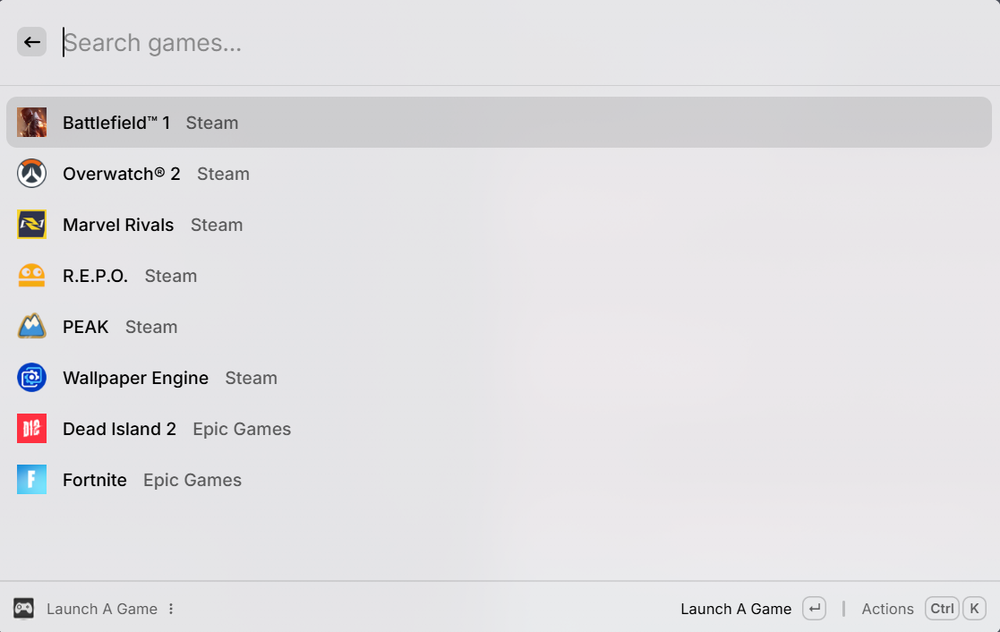
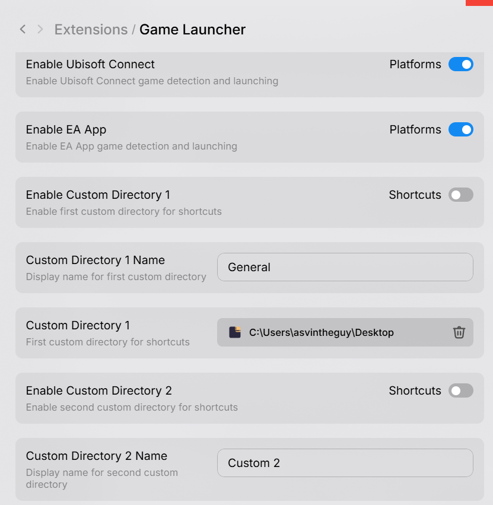

# Game Launcher for Raycast

A streamlined Raycast extension that provides instant access to your PC games across multiple platforms.





*Based on https://github.com/PuttTim/windows-terminal project structure & setup*

## Features

- Launch games from Steam, Epic Games, GOG, and other platforms
- Unified game library with platform-specific icons
- Keyboard shortcuts for quick access
- Automatic window closing after game launch

## Installation

This extension is not available in the Raycast Store (Windows-only extensions aren't supported yet).

### Prerequisites

Install the required dependencies:

```bash
winget install -e --id OpenJS.NodeJS
```

### Setup

1. Clone this repository
2. Install dependencies by running this command in your directory in terminal: `npm ci`
3. Start development mode to install the extension by running this command as well `npm run dev`
4. The extension will be automatically added to Raycast

## Usage Tips

- Assign a keyboard shortcut for quick access
- Games are automatically detected from installed platforms
- Use the settings to configure custom shortcut directories to add more games

## Contributing

Contributions are welcome! Feel free to submit issues or pull requests. 

*Note: This repository may be moved to the main raycast/extensions repository once Windows extensions are officially supported.*
